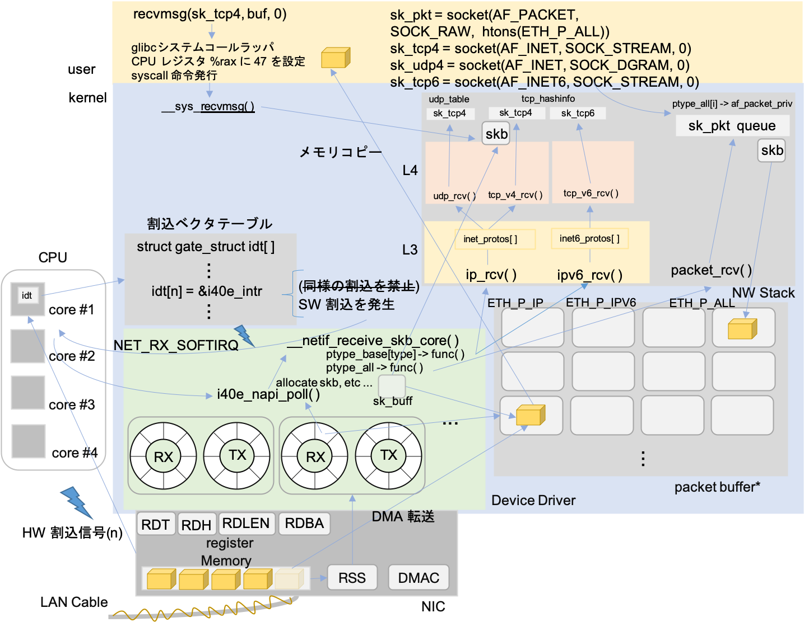
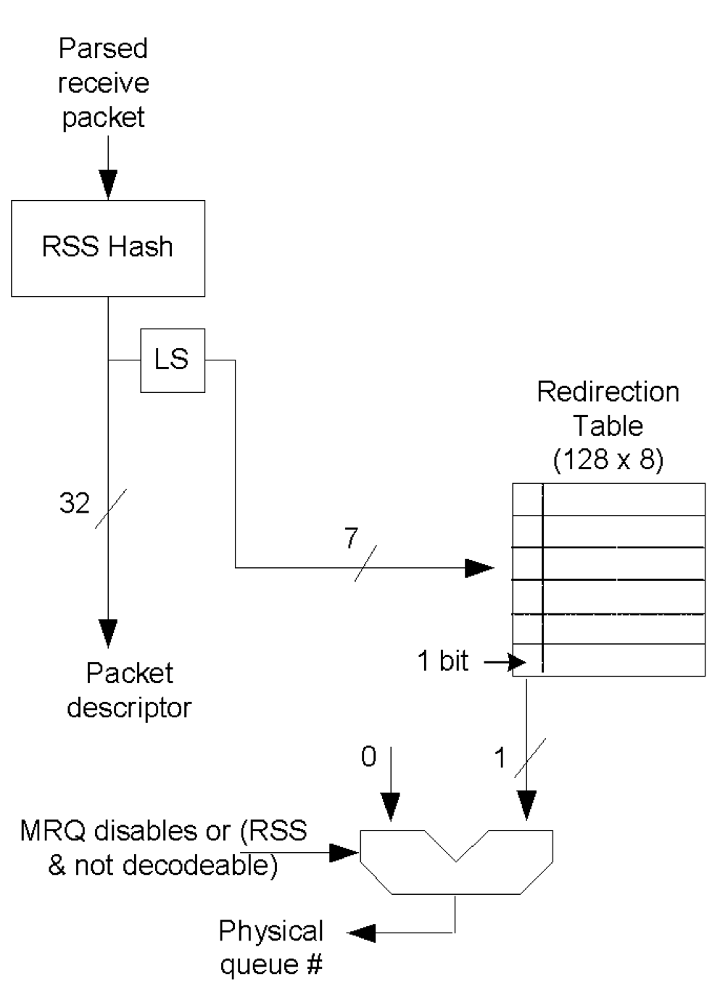
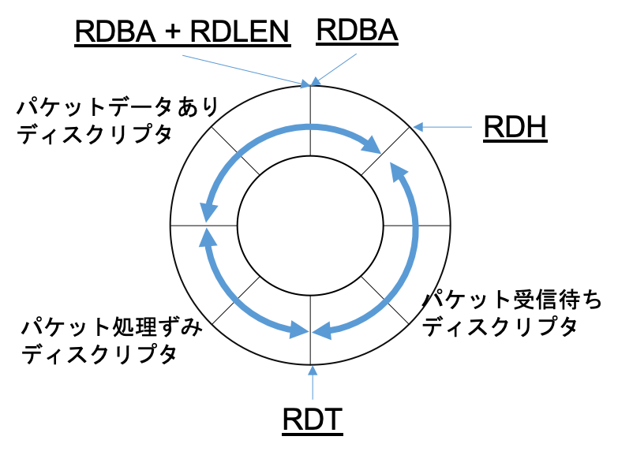

# はじめに
本記事は大学のラボメンバーに話した情報をなんとなくまとめてまとめたものです．

ターゲットはsocketプログラミングをしたことがあるが, システムコールの先ことを何も知らないような方を対象としております．
知識0からAF_XDPを理解して頂くため, ネットワークスタックを知っている方には冗長な部分もございます．

私の力不足で細かいところまで踏み込めてない箇所が多々あります．

今回お話する全体像と章立てはこのようになります．
ネットワークスタックのお話がメインではないので流れを見るためにレイヤごとの繋がり方を見る程度で各プロトコルの処理は追いません．

\*書いている途中で疲れてしまったためAF_XDP以外のTXパスは省略させて頂きます．




- パケット送受信

  Linuxのネットワークスタックを理解していただくため, TCP/IPソケット`socket(AF_INET, SOCK_STREAM, 0)`を利用した場合の下層処理を例に挙げてパケット送受信がどのように行われるのかお話します．
- XDP(eXpress Data Path)

  直訳して高速データパスですが, これによりネットワークスタックの何がどのように高速化するのかをお話します．
- eBPF(extended Barkrey Packet Filter)

  XDPではパケット処理にeBPFを用いますが, eBPFとは何なのかをお話します．
- AF_XDP

  基本的なネットワークスタックとそれを高速化するためのXDP, そしてXDP内部で用いられるeBPFについて理解した上で, ユーザ空間アプリケーションに高速にパケットを転送する機構である新しいアドレスファミリ, AF_XDPの動作とその実装についてお話します．
- サンプルeBPFプログラム(xdpsock_kern.c)

  `/linux/sample/bpf/xdpsock_kern.c`に存在するソースコードで, XDP中で動作するeBPFプログラムでXDPソケットにパケットを転送します．
- サンプルアプリケーション(xdpsock_user.c)

  `/linux/sample/bpf/xdpsock_user.c`に存在するソースコードで, `socket(AF_XDP, SOCK_RAW, 0)`として作成されたソケットを通してパケットを受信処理するユーザ空間アプリケーションです．

# Background

前提として環境は以下の通りで進めていきます．
Release Candidateな理由は適当にコードを眺めてた時のバージョンがv5.0-rc7だったためです．
- Kernel: Linux v5.0-rc7
- Arch: x86_64
- NIC Driver: i40e (Intel 40Gbit Ethernet)
- Others: NAPI, RSS on
つまりカーネルのコードにおいてアーキテクチャ依存のコードは`/arch/x86`,
NICデバイスドライバのコードは`/drivers/net/ethernet/intel/i40e`以下を参照します．
また, [Bootlin](https://elixir.bootlin.com/linux/v5.0-rc7/source)のようなサイトではなく[GitHub Linux Source](https://github.com/torvalds/linux)を用いる場合は以下のようにしてバージョンを合わせて下さい．
```sh
git clone https://github.com/torvalds/linux.git # 4GB近くあります
git tag
git checkout v5.0-rc7
```
\* フレーム, パケット, メッセージと言葉を使い分けるべきですが, すべてパケットと表記します．
\* 本筋とは関係のないソースコードは途中省略させて頂きます. 細かい部分も面白いんですが全て書くのは辛いです...

# パケット送受信
1. パケットは符号化された電気信号としてNICに届くため, NICは電気信号を復号化しNIC内メモリにパケットを一時保存します．(L1は詳しくないのでNIC内メモリに関しては想像です)
2. 受信したパケットはRSS(Receive Side Scaling)によって転送先のリングキューを決定します．
  
  - RSSは受信したパケットをハードウェアレベルで別個のリングキューに挿入し, それぞれのリングキューを別々のCPUで同時に処理するための仕組みでマルチコアスケーリングに貢献します．
  - RSSではフロー情報(TCP/IPなら送信元/送信先IPアドレス, ポート番号, プロトコル番号. NICによってはアドレスしか識別できないものも存在します)をハッシュチェインにかけて, 32bitのハッシュ値を算出します．
  このハッシュ値は`le32_to_cpu((union i40e_rx_desc *)rx_desc->wb.qword0.hi_dword.rss)`のようにして取得可能で,
  sk_buffが割り当てられた後は`sk_buff->hash`で保持されます.
  ハッシュチェインは比較的処理が重い上, ネットワークスタック処理でサブシステムごとに何度も計算が行われます.
  この冗長性を排除することでネットワークスタックのオーバーヘッド削減も可能です.[^1]
  - 算出したハッシュ値のうち下位7bitを用いてRedirection Tableを参照しフロー情報に対応するキューを決定します．
  - RSSの特徴として同一フローのパケットは同じリングキュー, つまりCPUに配送されるため, マルチコアによる同時処理においてもTCP処理におけるパケットの順序入れ替えの発生を避けることができます.
  (Redirection Tableの最上位1bitはQueue indexと説明されます[^2]が, 1bitからどのようにキュー番号に変換するのか, その仕組みは私にはわかりません. 1bitじゃ複数のキューの区別ができないです. これに関しては読み落としがある可能性があるので後で調査します.)
  ```sh
  // リングキュー毎の受信パケット確認
  # watch 'ethtool -S <interface name> | grep rx | grep packet'
  // フロー情報から転送されるリングキューを指定(IPv4 UDP src/dst port 4242を7番目のキューに挿入)
  # ethtool -n <interface name> flow-type udp4 src-port 4242 dst-port 4242 action 7
  // プロトコル毎に利用可能なフロー情報を表示
  # ethtool -n <interface name> rx-flow-hash tcp6
  ```
3. 決定したリングキューに対応するRDH(Receive Descriptor Head)レジスタのポインタに従ってRX_RINGからRXディスクリプタを取得します.
  - リングキューはデバイスドライバによってホストマシンのメモリ上に作成され, NICのレジスタにリングキューに関するポインタが設定されます.
  - RDH: 次に受信したパケットを挿入するディスクリプタを指すレジスタ
  - RDT: 受信待ち(空のパケットバッファを持つ)ディスクリプタの最後をさすレジスタ. RDH = RDTとなればキューが一杯と判断し受信パケットをドロップ
  - RDLEN: リングキューの長さ
  - RDAB: リングキューの開始アドレス
  
  (この図は想像を含みます.コードの確認まではしておりません.)

4. RXディスクリプタ`struct i40e_rx_desc # /drivers/net/ethernet/intel/i40e/i40e_txrx.h`からDMAアドレスを取得し, NICメモリからカーネルメモリ内のパケットバッファへDMA転送し, RDHを1つ進めます.
この処理はカーネルとは非同期に随時動作します.
  - DMA転送とはCPUを介さずNICとメモリが直接データをやりとりする転送方式です.
  DMA転送する場合パケットバッファのキャッシュを無効化する必要があります.
  キャッシュが有効な場合, DMAはCPUを介さないため転送データがCPUキャッシュに反映されません.
  よってCPUに残ったキャッシュと実際のメモリデータの不一致が発生してしまうためです.
  - (パケットバッファがDMAマッピングされている間のみキャッシュを無効化しているような**気がします**.
  つまりRXリングにディスクリプタを登録する際にパケットバッファから空いている領域のアドレスを登録すると同時にDMAマッピング処理をし, そのアドレスにおけるキャッシュ機能を無効化. RXリングから受信済みパケットを取得直後にDMAマッピングを解除すると同時にキャッシュ機能を有効化)
  - (この辺りはデバイスドライバのRXリングにディスクリプタを挿入するコード`i40e_alloc_rx_buffers # i40e/i40e_txrx.c`あたりから参照すると正誤が確認できると思いますが未確認です)

5. ある程度DMAによってカーネルにパケット転送が済んだ後, NICはリングキューに結びついたCPUに対してハードウェア割り込み信号を発生させます.
  - 割り込み発生のタイミングはNICによって様々な方法が存在します.
  例えば, 一定時間おきに発生, パケット受信をトリガーとして一定時間後に割り込み発生を設定し遅延発生, パケット受信待ちディスクリプタが一定値を下回った場合に発生などです[^1]．
  低負荷なネットワークにおいては昔のように1パケット受信ごとに割り込み信号を発生させるNICも存在すると思います.
  - 割り込み信号は, その種類を通知するためある数字が添えられます(レガシーな方式なのかもしれません).
  PCIデバイスではMSI-X(Message Signaled Interrupt eXtended)によって割り込みを発生させるらしいのですが, 勉強不足でして私は知りません.
  そのため, これ以降はMSI-X用の割り込みハンドラ(`i40e_vsi_request_irq_msix # i40e/i40e_main.cにて登録`ではなくレガシーな割り込み方式のハンドラ(`i40e_intr # i40e/i40e_main.c`)を参照します.

6. CPUには割り込みベクタテーブルへの参照を保持するレジスタが存在し, そのポインタから割り込み番号だけ進めた位置にあるデータ, つまり割り込み信号に対応する割り込みハンドラ(`i40e_intr`)を実行します.
  ```c
  # /arch/x86/kernel/idt.c 割り込みベクタテーブルの定義
  gate_desc idt_table[IDT_ENTRIES] __page_aligned_bss;
  # i40e/i40e_main.c 割り込みハンドラの登録
  err = request_irq(pf->msix_entries[0].vector, i40e_intr, 0, pf->int_name, pf);
  ```
  - 大体のOSにおいて割り込みには2つのレベルが存在し, FLIH(First-Level Interrupt Handler)の実行中, 他の割り込みは無視される.
  SLIH(Second-Level Interrupt Handler)の実行中は他のプロセスと同等にスケジューリングされ割り込みも受け付ける.
  レベルを分けるのはシステムのハードウェアに対する反応性を向上させるためなどに理由による.
  つまり, TCP/IPのような重たい処理をFLIH, つまりあらゆる割り込みを無効化して実行するとその間, マウスやキーボードのイベントを処理できなくなるためである.
  - この処理はハードウェア割り込みのコンテキストで実行されます．(FLIH)
  このままTCP/IPのような重い処理に入るのは前述の通り好ましくないためソフトウェア割り込みをスケジュールし割り込みハンドラを終了します.
  ```c
  // i40e/i40e_main.c
  static irqreturn_t i40e_intr(int irq, void *data)
  {
    // ...
    napi_schedule_irqoff(&q_vector->napi)
    // ...
  }
  // /include//linux/netdevice.h
  static inline void napi_schedule_irqoff(struct napi_struct *n)
  {
	  if (napi_schedule_prep(n)) // NAPIが動作中でないか確認
		  __napi_schedule_irqoff(n);
  }
  // net//core/dev.c
  void __napi_schedule_irqoff(struct napi_struct *n)
  {
    ____napi_schedule(this_cpu_ptr(&softnet_data), n); // CPU毎に存在するデータ構造の1つであるsoftnet_data変数を取得
  }
  static inline void ____napi_schedule(struct softnet_data *sd, struct napi_struct *napi)
  {
    list_add_tail(&napi->poll_list, &sd->poll_list);  // NICにおける割り込み信号はCPU毎に分けて処理しているため, CPU毎のデータ構造が必要
    __raise_softirq_irqoff(NET_RX_SOFTIRQ); // NET_RX_SOFTIRQ ソフトウェア割り込みを発生
  }
  ```
  - ここでnapiというワードが登場します.
  昔のパケットごとの割り込み処理方式は割り込みによるオーバーヘッドが大きく, 高速化するネットワークを捌ききれなくなりました．
  そこでCPUを100%利用し, 常にRXリングを監視することでパケットを処理するポーリングモードが登場しますが, もちろんパケットが来なくてもCPUは占有されますので, 資源が勿体無いです．
  ここでハイブリッド方式のNAPI方式が登場しました.
  これはNICから割り込みを受け取ると, FLIHは後続の割り込みを無視するように設定した後でポーリング関数を動作させるソフトウェア割り込みを発生させます.
  ソフトウェア割り込みによりSLIHとして動作するポーリング関数によってRXキューが空になるか, 設定したバッチサイズ分だけTCP/IPなどのネットワークスタック処理を行い, ハードウェア割り込みを有効化して終了するものです.
  - つまり, NAPIの概念によれば, この`napi_schedule_irqoff`の付近にハードウェア割り込みをマスクする処理が含まれているはずなのですが見つけることができませんでした.

7. ソフトウェア割り込み
  - NET_RX_SOFTIRQに対応したハンドラ`net_rx_action`が実行されます.
  ドライバ毎のNAPIポーリング関数実行までの処理をまずは追ってみましょう.
  ```c
  // net/core/dev.c
  static int __init net_dev_init(void)
  {
    open_softirq(NET_RX_SOFTIRQ, net_rx_action); // NET_RX_SOFTIRQに対応するハンドラnet_rx_actionが登録されています
  }
  subsys_initcall(net_dev_init); // subsys_initcallマクロによってnet_dev_init()はシステム起動時の初期化処理に組み込まれます.
  // マクロ展開と初期化処理への追加部分が気になる場合はご自身でコードを読むか, コメント頂ければ書かせて頂きます.(すでにまとめられた記事もありそうですね)
  static __latent_entropy void net_rx_action(struct softirq_action *h)
  {
    struct softnet_data *sd = this_cpu_ptr(&softnet_data);
    list_splice_init(&sd->poll_list, &list);
    for (;;) {
      n = list_first_entry(&list, struct napi_struct, poll_list);
      budget -= napi_poll(n, &repoll);
    }
  }
  static int napi_poll(struct napi_struct *n, struct list_head *repoll)
  {
    weight = n->weight;
    work = n->poll(n, weight);  // 読むのがしんどくなるポイントその１だと思います: kernelはコールバックが多くて何に繋がるのかわかりにくい..
    // このpollは上述のapi_schedule_irqoff(&q_vector->napi)のq_vectorに登録された関数ポインタです
    // ではq_vectorへの登録処理はどこで存在し, それはいつ実行されるのでしょうか
  }
  // i40e/i40e_main.c
  static int i40e_vsi_alloc_q_vector(struct i40e_vsi *vsi, int v_idx, int cpu)
  {
    struct i40e_q_vector *q_vector;
    q_vector->vsi = vsi;
    q_vector->v_idx = v_idx;
    if (vsi->netdev)
      netif_napi_add(vsi->netdev, &q_vector->napi, i40e_napi_poll, NAPI_POLL_WEIGHT); // i40e_napi_pollがq_vector->napiに登録される
  }
  // net/core/dev.c
  void netif_napi_add(struct net_device *dev, struct napi_struct *napi, int (*poll)(struct napi_struct *, int), int weight)
  {
    napi->poll = poll;
    napi->weight = weight;
  }
  // i40e/i40e_main.c
  static int i40e_vsi_setup_vectors(struct i40e_vsi *vsi)
  {
    ret = i40e_vsi_alloc_q_vectors(vsi);
  }
  struct i40e_vsi *i40e_vsi_setup(struct i40e_pf *pf, u8 type, u16 uplink_seid, u32 param1)
  {
    ret = i40e_vsi_setup_vectors(vsi);
  }
  static void i40e_fdir_sb_setup(struct i40e_pf *pf)
  {
    vsi = i40e_vsi_setup(pf, I40E_VSI_FDIR, pf->vsi[pf->lan_vsi]->seid, 0);
  }
  static int i40e_setup_pf_switch(struct i40e_pf *pf, bool reinit)
  {
    i40e_fdir_sb_setup(pf);
  }
  static int i40e_probe(struct pci_dev *pdev, const struct pci_device_id *ent)
  {
    err = i40e_setup_pf_switch(pf, false);
  }
  static struct pci_driver i40e_driver = {
        .name     = i40e_driver_name,
        .id_table = i40e_pci_tbl,
        .probe    = i40e_probe, // システム起動時などにpciデバイスリストに登録されている全デバイスのprobe()が実行される
        .remove   = i40e_remove,
        .driver   = {
                .pm = &i40e_pm_ops,
        },
        .shutdown = i40e_shutdown,
        .err_handler = &i40e_err_handler,
        .sriov_configure = i40e_pci_sriov_configure,
  };
  static int __init i40e_init_module(void)
  {
    return pci_register_driver(&i40e_driver);
  }
  module_init(i40e_init_module); // マクロ展開によって, システム起動時にi40e_init_module()を実行するように設定
  ```
  - 以上の通り`n->poll(n, weight)`で実行される関数は`i40e_napi_poll`であることがわかりました.
  ここから先はデバイスドライバによるデータリンク層の処理, カーネルネットワークスタックによるネットワーク/トランスポート層の処理を経てユーザアプリケーションにrecvされるために特定のソケットのキューにパケットバッファへのポインタを設定するのみです．(カーネルサイドの処理としては)

8. NAPI poll
  - TXリングの送信済みパケットの後処理とRXリングへのディスクリプタの補充, RXリングのパケットの処理を行います．
  GRO(Generic Receive Offload)の開始までを見ていきます．
  ここのRXの処理中にXDPのドライバレベルフックが存在します．
  後半でもう一つのGeneric XDP(NICがXDPをサポートしない場合のXDPフック)が登場します．
  ```c
  // i40e/i40e.h
  struct i40e_q_vector {
    struct i40e_vsi *vsi;
    u16 v_idx;		/* index in the vsi->q_vector array. */
    u16 reg_idx;		/* register index of the interrupt */
    struct napi_struct napi;
    struct i40e_ring_container rx;
    struct i40e_ring_container tx;
    u8 num_ringpairs;	/* total number of ring pairs in vector */
    cpumask_t affinity_mask;
  } ____cacheline_internodealigned_in_smp;

  struct i40e_ring_container {
    struct i40e_ring *ring;		/* pointer to linked list of ring(s) */
    unsigned long next_update;	/* jiffies value of next update */
    u16 count;
  };

  // i40e/i40e_txrx.h
  struct i40e_ring {
	  struct i40e_ring *next;		/* pointer to next ring in q_vector */
	  void *desc;			/* Descriptor ring memory */
	  struct device *dev;		/* Used for DMA mapping */
	  struct net_device *netdev;	/* netdev ring maps to */
	  struct bpf_prog *xdp_prog;
	  union {
		  struct i40e_tx_buffer *tx_bi;
		  struct i40e_rx_buffer *rx_bi;
	  };
	  u16 queue_index;		/* Queue number of ring */
    u16 next_to_use;
    u16 next_to_clean;
    dma_addr_t dma;			/* physical address of ring */
    struct i40e_vsi *vsi;		/* Backreference to associated VSI */
    struct i40e_q_vector *q_vector;	/* Backreference to associated vector */
    struct xdp_rxq_info xdp_rxq;
    struct xdp_umem *xsk_umem;
    struct zero_copy_allocator zca; /* ZC allocator anchor */
  } ____cacheline_internodealigned_in_smp;

  // i40e/i40e_txrx.c
  int i40e_napi_poll(struct napi_struct *napi, int budget)
  {
  // i40e_q_vector->napiの関係にあり, napiのアドレスからi40e_q_vector構造体の先頭アドレスを計算
  //   include//linux/kernel.h\
  //   # define container_of_safe(ptr, type, member) ({				\
  //        void *__mptr = (void *)(ptr);					\
  //        ((type *)(__mptr - offsetof(type, member))); }
	struct i40e_q_vector *q_vector = container_of(napi, struct i40e_q_vector, napi);
	struct i40e_vsi *vsi = q_vector->vsi;
	struct i40e_ring *ring;

	i40e_for_each_ring(ring, q_vector->tx) {
  // 送信済みのTXリング中のデータを処理します
  // TXリングからディスクリプタを取り出し, パケットバッファを解放します.(そのパケットが他から参照されていない場合ですが)
  // DMAマッピングを解除します, NAPIにおけるcompletion割り込みの処理です
		bool wd = ring->xsk_umem ?  // キューにたいしてAF_XDPソケットが機能している場合xsk_umemに値が設定されます
			  i40e_clean_xdp_tx_irq(vsi, ring, budget) : // AF_XDPのデータパスです, XDPフックポイントそのものではありません．
			  i40e_clean_tx_irq(vsi, ring, budget); // 通常のデータパスです
	}

  // i40e_q_vectorはcpumask_t affinity_maskによって動作するCPUを制限し,
  // struct i40e_ring_container rx には複数のringが連なっています
  // コアが多ければ1リングペアを1コアに割り当てるが, そうでない場合同一コアに複数のリングペアを割り当てることもできます
  // その場合, budget: つまり1回のポーリングで処理するパケット数はq_vector単位で共有されるため公平に割り当てます
	budget_per_ring = max(budget/q_vector->num_ringpairs, 1);

	i40e_for_each_ring(ring, q_vector->rx) {
		int cleaned = ring->xsk_umem ?
			      i40e_clean_rx_irq_zc(ring, budget_per_ring) : // txと同様でAF_XDPのデータパスです
			      i40e_clean_rx_irq(ring, budget_per_ring); // 通常のデータパスです
	}

	if (likely(napi_complete_done(napi, work_done))) // ポーリング処理が終わったらpollをnapiリストから除外します
		i40e_update_enable_itr(vsi, q_vector);  // 無効にした割り込み信号を有効にしている(?)
  }
  ```
  - まずは簡単にtx_ringに関する上の処理を見ます
  ```c
  # i40e/i40e_txrx.c
  static bool i40e_clean_tx_irq(struct i40e_vsi *vsi, struct i40e_ring *tx_ring, int napi_budget)
  {
    u16 i = tx_ring->next_to_clean; # ソフトウェア的に保持している次に処理すべきディスクリプタのインデックス, 前回のポーリングで処理したところの次です
    struct i40e_tx_buffer *tx_buf;
    struct i40e_tx_desc *tx_head;
    struct i40e_tx_desc *tx_desc;
    unsigned int budget = vsi->work_limit;

    tx_buf = &tx_ring->tx_bi[i];
    tx_desc = I40E_TX_DESC(tx_ring, i); TX_RINGから
    tx_head = I40E_TX_DESC(tx_ring, i40e_get_head(tx_ring)); # レジスタのさすHEADとは異なるソフトウェア的に認識しているHEADだと思われます
    do {
      if (tx_head == tx_desc) # バッチサイズ分処理する前に先頭に追いついた場合は終了
        break;
      if (ring_is_xdp(tx_ring))
        xdp_return_frame(tx_buf->xdpf); # XDP(!= AF_XDP)が有効な場合のパケットバッファ解放
      else
        napi_consume_skb(tx_buf->skb, napi_budget); # 通常時のパケットバッファ解放処理(後述)
      dma_unmap_single(tx_ring->dev, dma_unmap_addr(tx_buf, dma), dma_unmap_len(tx_buf, len), DMA_TO_DEVICE); # DMAマッポングを解除
      tx_buf->skb = NULL;
      dma_unmap_len_set(tx_buf, len, 0);
      budget--;
    } while (likely(budget));
  }
  # net//core/skbuff.c
  void napi_consume_skb(struct sk_buff *skb, int budget)
  {
	  if (!skb_unref(skb)) # skbに参照が残っている場合は解放しない
      return;
	  _kfree_skb_defer(skb);
  }
  static inline void _kfree_skb_defer(struct sk_buff *skb)
  {
    skb_release_all(skb);
  }
  static void skb_release_all(struct sk_buff *skb)
  {
    skb_release_head_state(skb);
    if (likely(skb->head))
      skb_release_data(skb);
  }
  static void skb_release_data(struct sk_buff *skb)
  {
    skb_free_head(skb);
  }
  static void skb_free_head(struct sk_buff *skb)
  {
    unsigned char *head = skb->head;
    if (skb->head_frag)
      skb_free_frag(head);
    else
      kfree(head);
  }

  # 次にポーリング時の受信時の処理を見ていきます
  static int i40e_clean_rx_irq(struct i40e_ring *rx_ring, int budget)
  {
    struct sk_buff *skb = rx_ring->skb;
    u16 cleaned_count = I40E_DESC_UNUSED(rx_ring);
    unsigned int xdp_xmit = 0;
    struct xdp_buff xdp;

    xdp.rxq = &rx_ring->xdp_rxq;

    while (likely(total_rx_packets < (unsigned int)budget)) {
      struct i40e_rx_buffer *rx_buffer;
      union i40e_rx_desc *rx_desc;
      unsigned int size;
      u64 qword;

      if (cleaned_count >= I40E_RX_BUFFER_WRITE) {
      # パケット処理済みディスクリプタが一定数以上になれば, 新規パケットを受信できるようにディスクリプタを準備します
      # パケットバッファの割り当てとDMAへのマッピングです
        failure = failure ||
            i40e_alloc_rx_buffers(rx_ring, cleaned_count);
        cleaned_count = 0;
      }
      rx_desc = I40E_RX_DESC(rx_ring, rx_ring->next_to_clean);
      size = (qword & I40E_RXD_QW1_LENGTH_PBUF_MASK) >> I40E_RXD_QW1_LENGTH_PBUF_SHIFT;
      rx_buffer = i40e_get_rx_buffer(rx_ring, size);
      if (!skb) { # 通常rx_ring->skbはNULLですのでここの処理に入ります
        xdp.data = page_address(rx_buffer->page) + rx_buffer->page_offset; # パケットデータへのポインタをセットします
        xdp.data_meta = xdp.data;
        xdp.data_hard_start = xdp.data - i40e_rx_offset(rx_ring);
        xdp.data_end = xdp.data + size;
        # デバイスのキューにXDPプログラムがアタッチされている場合, XDPプログラムを実行します
        # 戻り値はI40E_XDP_{PASS, CONSUMED, TX, REDIR}(0, 1, 2, 4)をマイナス値にしたものをvoid *にキャストした値です
        # XDPがアタッチされない場合は通常のネットワークスタックへのパスですので, XDP_PASSつまり0が返ります
        skb = i40e_run_xdp(rx_ring, &xdp);  # XDPの節で詳しく見ていきます
      }

      if (IS_ERR(skb)) { # I40E_XDP_PASS以外の場合です
        unsigned int xdp_res = -PTR_ERR(skb);

        if (xdp_res & (I40E_XDP_TX | I40E_XDP_REDIR)) {
          xdp_xmit |= xdp_res;
          i40e_rx_buffer_flip(rx_ring, rx_buffer, size);
        } else {
          rx_buffer->pagecnt_bias++;
        }
        total_rx_bytes += size;
        total_rx_packets++;
      } else if (skb) { # 通常skb = NULL = 0 = falseです
        i40e_add_rx_frag(rx_ring, rx_buffer, skb, size);
      } else if (ring_uses_build_skb(rx_ring)) { # リングのI40E_RXR_FLAGS_BUILD_SKB_ENABLEDフラグをチェックします
        skb = i40e_build_skb(rx_ring, rx_buffer, &xdp); # フラグがonならskbをアロケートし既存のバッファのアドレスを用いてskbを構築します(パケットデータはコピーしません)
      } else {
        skb = i40e_construct_skb(rx_ring, rx_buffer, &xdp); # skbをアロケートし, パケットをデータ毎全てコピーします
      }
      if (i40e_cleanup_headers(rx_ring, skb, rx_desc)) { # 何かの処理をしますが, 今回重要なのはXDPが有効な場合はtrueを返すことです
        skb = NULL;
        continue;
      }
      i40e_process_skb_fields(rx_ring, rx_desc, skb); # skbの各種フィールドを設定します. RSSのhashなどもここから利用可能になります
      napi_gro_receive(&rx_ring->q_vector->napi, skb); # Linuxネットワークスタックに続くルートで, GRO(Generic Receive Offload)を実行します
      # ここへ処理が戻るのはネットワークスタックの処理が終わって, リングの次ディスクリプタが指すパケットを処理するタイミングです
      skb = NULL;
    }
    i40e_finalize_xdp_rx(rx_ring, xdp_xmit);
    return failure ? budget : (int)total_rx_packets;
  }

  bool i40e_alloc_rx_buffers(struct i40e_ring *rx_ring, u16 cleaned_count)
  {
	  u16 ntu = rx_ring->next_to_use;
  	union i40e_rx_desc *rx_desc;
	  struct i40e_rx_buffer *bi;
    rx_desc = I40E_RX_DESC(rx_ring, ntu);
    bi = &rx_ring->rx_bi[ntu];

    do {
      if (!i40e_alloc_mapped_page(rx_ring, bi)) # 新規パケットバッファを割り当てます
        goto no_buffers;
      # 新規バッファをDMAマッピングします
      dma_sync_single_range_for_device(rx_ring->dev, bi->dma, bi->page_offset, rx_ring->rx_buf_len, DMA_FROM_DEVICE);
      rx_desc->read.pkt_addr = cpu_to_le64(bi->dma + bi->page_offset);
      rx_desc++;
      bi++;
      ntu++;
      cleaned_count--;
    } while (cleaned_count);
	  return false;
  }

  static struct sk_buff *i40e_build_skb(struct i40e_ring *rx_ring, struct i40e_rx_buffer *rx_buffer, struct xdp_buff *xdp)
  {
    unsigned int metasize = xdp->data - xdp->data_meta;
    unsigned int truesize = i40e_rx_pg_size(rx_ring) / 2;
    struct sk_buff *skb;

    prefetch(xdp->data_meta); # L1キャッシュにデータを乗せるためプリフェッチします
    skb = build_skb(xdp->data_hard_start, truesize); # skbをアロケートします
    skb_reserve(skb, xdp->data - xdp->data_hard_start);
    __skb_put(skb, xdp->data_end - xdp->data);
    if (metasize)
      skb_metadata_set(skb, metasize);
    rx_buffer->page_offset ^= truesize;
    return skb;
  }
  ```

  - XDP処理がskbアロケートより前に動作することがわかりましたでしょうか．
  具体的なXDP実行の処理`i40e_run_xdp()`は後ほど確認します．

9. Generic Receive Offload ~ L3の呼び出し
  - GROとは同一フローの隣り合った複数パケットを繋げられるところまで1つに繋いで上位のレイヤに渡すことでネットワークスタックの実行回数を減らす仕組みです.
  ```c
  # /net/core/dev.c
  gro_result_t napi_gro_receive(struct napi_struct *napi, struct sk_buff *skb)
  {
    gro_result_t ret;
    skb_mark_napi_id(skb, napi);
    skb_gro_reset_offset(skb);
    # dev_gro_receive()内でフローの識別, napi->gro_hash[]のリストにskbを接続します
    # 接続した場合GRO_HELDなどが返るためnapi_skb_finish()内部処理は何もせずreturnします
    # 接続が切れた場合GRO_NORMALが返り, ネットワークスタック処理に続きます
    ret = napi_skb_finish(dev_gro_receive(napi, skb), skb);
    return ret;
  }
  static gro_result_t napi_skb_finish(gro_result_t ret, struct sk_buff *skb)
  {
    switch (ret) {
    case GRO_NORMAL:
      if (netif_receive_skb_internal(skb))
        ret = GRO_DROP;
      break;
    case GRO_DROP:
      kfree_skb(skb);
      break;
    case GRO_MERGED_FREE:
      if (NAPI_GRO_CB(skb)->free == NAPI_GRO_FREE_STOLEN_HEAD)
        napi_skb_free_stolen_head(skb);
      else
        __kfree_skb(skb);
      break;
    case GRO_HELD:
    case GRO_MERGED:
    case GRO_CONSUMED:
      break;
    }
    return ret;
  }
  static int netif_receive_skb_internal(struct sk_buff *skb)
  {
    int ret;
    if (static_branch_unlikely(&generic_xdp_needed_key)) {
      int ret;
      preempt_disable();
      rcu_read_lock();
      ret = do_xdp_generic(rcu_dereference(skb->dev->xdp_prog), skb); # Generic XDPのフックポイントです. L3の処理に入る直前に存在します.
      rcu_read_unlock();
      preempt_enable();
      if (ret != XDP_PASS)
        return NET_RX_DROP;
    }
    rcu_read_lock();
  #ifdef CONFIG_RPS # Receive Packet Steeringです. 先ほど見たRSSのソフトウェア実装で, RSS非対応NICでもマルチコアスケールさせたい場合に使ったりします.
    if (static_key_false(&rps_needed)) {
      struct rps_dev_flow voidflow, *rflow = &voidflow;
      int cpu = get_rps_cpu(skb->dev, skb, &rflow);

      if (cpu >= 0) {
        ret = enqueue_to_backlog(skb, cpu, &rflow->last_qtail);
        rcu_read_unlock();
        return ret;
      }
    }
  #endif
    ret = __netif_receive_skb(skb); # L3処理までもうすぐです.
    rcu_read_unlock();
    return ret;
  }
  static int __netif_receive_skb(struct sk_buff *skb)
  {
    ret = __netif_receive_skb_one_core(skb, false);
    return ret;
  }
  static int __netif_receive_skb_one_core(struct sk_buff *skb, bool pfmemalloc)
  {
    struct net_device *orig_dev = skb->dev;
    struct packet_type *pt_prev = NULL;
    int ret;
    ret = __netif_receive_skb_core(skb, pfmemalloc, &pt_prev);
    if (pt_prev)
            ret = pt_prev->func(skb, skb->dev, pt_prev, orig_dev);
    return ret;
  }
  # この関数内でL3の処理を呼び出します
  # 次の処理が登録されている場所は4箇所存在, それらは全てリスト構造になっています
  # ptype_all, ptype_base, デバイスを指定して結びついたdev->ptype_all, dev->ptype_specificです
  static int __netif_receive_skb_core(struct sk_buff *skb, bool pfmemalloc, struct packet_type **ppt_prev)
  {
    struct packet_type *ptype, *pt_prev;
    rx_handler_func_t *rx_handler;
    struct net_device *orig_dev;
    bool deliver_exact = false;
    int ret = NET_RX_DROP;
    __be16 type;

    orig_dev = skb->dev;
    pt_prev = NULL;
    # ptype_all, ptype_baseはstruct packet_typeのリストを持つグローバル変数です. 詳細を後述します.
    list_for_each_entry_rcu(ptype, &ptype_all, list) { # ptype_allに設定されたコールバック関数を最後の1つを残して全て実行します.
      if (pt_prev)
        ret = deliver_skb(skb, pt_prev, orig_dev); # ここで実行されうるものの例としては全プロトコル指定で作成したAF_PACKETのソケットへの転送があります
      pt_prev = ptype;
    }
    list_for_each_entry_rcu(ptype, &skb->dev->ptype_all, list) {
      if (pt_prev)
        ret = deliver_skb(skb, pt_prev, orig_dev);
      pt_prev = ptype;
    type = skb->protocol;
    if (likely(!deliver_exact)) {
      deliver_ptype_list_skb(skb, &pt_prev, orig_dev, type, &ptype_base[ntohs(type) & PTYPE_HASH_MASK]);
    }
    deliver_ptype_list_skb(skb, &pt_prev, orig_dev, type, &orig_dev->ptype_specific);
    if (unlikely(skb->dev != orig_dev)) {
      deliver_ptype_list_skb(skb, &pt_prev, orig_dev, type, &skb->dev->ptype_specific);
    }
    if (pt_prev) {
      *ppt_prev = pt_prev; # 最後のpt_prevに入っているコールバック関数は呼び出し元でコールされます
    } else {
  drop:
      kfree_skb(skb);
      ret = NET_RX_DROP;
    }
  out:
    return ret;
  }

  # void dev_add_pack(struct packet_type *pt); によって, typeに従った場所へ登録されます
  # AF_PACKETソケットの場合は, ソケット作成時, 第三引数で指定したプロトコルによってptype_baseかptype_allにコールバック関数packet_rcv()が設定されます.
  # この時af_packet_privにソケットへのポインタを設定します.
  # AF_INETソケットの場合, ptype_base[hash(ETH_P_IP)]に共有の受信関数ip_rcv()が登録されます.
  # AF_INET6ソケットの場合, ptype_base[hash(ETH_P_IPV6)]に共有の受信関数ipv4_rcv()が登録されます.
  # include//linux/netdevice.h
  struct packet_type {
     __be16			type;	/* This is really htons(ether_type). */
    bool			ignore_outgoing;
    struct net_device	*dev;	/* NULL is wildcarded here	     */
    int			(*func) (struct sk_buff *, struct net_device *, struct packet_type *, struct net_device *);
     void			(*list_func) (struct list_head *,
                   struct packet_type *,
                   struct net_device *);
     bool			(*id_match)(struct packet_type *ptype,
                 struct sock *sk);
     void			*af_packet_priv;
     struct list_head	list;
  };

  # net/core/dev.c
  void dev_add_pack(struct packet_type *pt)
  {
    struct list_head *head = ptype_head(pt);
    spin_lock(&ptype_lock);
    list_add_rcu(&pt->list, head); # ptype_all, ptype_base, dev->ptype_all, dev->ptype_specificのいずれかに登録される
    spin_unlock(&ptype_lock);
  }
  static inline struct list_head *ptype_head(const struct packet_type *pt)
  {
    if (pt->type == htons(ETH_P_ALL))  # 全てのプロトコルを受信する場合はptype_allです
      return pt->dev ? &pt->dev->ptype_all : &ptype_all;
    else  # 特定のプロトコルを指定した場合はdev->ptype_specificかptype_baseです
      return pt->dev ? &pt->dev->ptype_specific : &ptype_base[ntohs(pt->type) & PTYPE_HASH_MASK];
  }
  ```

10. AF_PACKETの場合
  - まずはコールバックが本当にpacket_rcvなのか確認します
  ソケットの作成はsocketシステムコールでカーネルにコンテキストスイッチした後にアドレスファミリ毎に登録されたソケット作成関数をコールバックで呼び出します.
  ソケット作成関数はアドレスファミリを管理するモジュールがロードされた時に`sock_register()`関数をコールします
  これによってグローバル変数である`net_families`変数の配列に登録します.
  - この仕組みをソースコードから読み解く順序として取り掛かりやすいのはおそらくsocketシステムコールから追いかけることだと思います.
  少しやってみましょう.
  ```
    # 何箇所か知識が必要な点があります.
    # 1つ目はシステムコールはCPUのraxレジスタにシステムコール番号を設定してsyscall命令を発行する必要があるという点です.
    # このシステムコール番号はアーキテクチャによってまちまちなのでglibcなどのライブラリが提供するシステムコールラッパを介してシステムコールを実行します.
    # x86_64, gnu, linuxにおいて通常の関数呼び出しの引数は1番目から順に, (rdi, rsi, rdx, rcx, r8, r9, スタック)と設定されます.
    # 一方システムコールは引数を6つまでしか渡すことができず, (rdi, rsi, rdx, r10, r8, r9)を用いて設定します.
    # プログラムをコンパイルした際にシステムコールもラッパを使う限り関数なため, コンパイラは通常の関数呼び出しの順で機械語命令を生成します.
    # そのため, システムコールラッパがrcxの値をr10にコピーしてraxにアーキテクチャ依存のシステムコール番号を設定し, syscall命令を発生させるコードを挟む必要があります.
    # このようなバイナリレベルの規約をABI(Application Binary Interface)と呼びます.
  ```
  - では, socketシステムコール先を見ていきましょう
  ```c
  # システムコールはSYSCALL_DEFINEマクロを用いて作成されます.
  # net/socket.c
  SYSCALL_DEFINE3(socket, int, family, int, type, int, protocol)
  {
    return __sys_socket(family, type, protocol);
  }
  int __sys_socket(int family, int type, int protocol)
  {
    struct socket *sock;
    retval = sock_create(family, type, protocol, &sock);  # ソケットを作成しsockにポインタを設定します
    # current->files->dftから空いているファイルディスクリプタを取得します
    # 作成したソケットをファイルとしてマップし, file->fdt[fd]に登録しファイルディスクリプタfdを返します
    return sock_map_fd(sock, flags & (O_CLOEXEC | O_NONBLOCK));
  }
  int sock_create(int family, int type, int protocol, struct socket **res)
  {
    return __sock_create(current->nsproxy->net_ns, family, type, protocol, res, 0);
  }
  int __sock_create(struct net *net, int family, int type, int protocol, struct socket **res, int kern)
  {
    struct socket *sock;
    const struct net_proto_family *pf;
    sock = sock_alloc(); # socket構造体をアロケートします
    sock->type = type;
    pf = rcu_dereference(net_families[family]); # net_familiesの対応するアドレスファミリのエントリーを取得します
    pf->create(net, sock, protocol, kern); # net_families[family]に登録されたcreateコールバックを呼び出します
    *res = sock;
    return 0
  }
  ```
  またコールバックが出てきましたね.
  net_familiesへ登録している場所を探すことから始めます.
  もちろん具体的に的を絞ってIPv4もモジュールを眺めてもいいと思います.
  思いつきで次のようにコマンドを実行してみると
  ```sh
  $ grep -r net_families net/
  net//socket.c:static const struct net_proto_family __rcu *net_families[NPROTO] __read_mostly;
  net//socket.c:	if (rcu_access_pointer(net_families[family]) == NULL)
  net//socket.c:	pf = rcu_dereference(net_families[family]);
  net//socket.c:	if (rcu_dereference_protected(net_families[ops->family],
  net//socket.c:		rcu_assign_pointer(net_families[ops->family], ops);
  net//socket.c:	RCU_INIT_POINTER(net_families[family], NULL);
  net//socket.c:	return family < NPROTO && rcu_access_pointer(net_families[family]);
  ```
  この中で登録しているように見える処理は`rcu_assign_pointer(net_families[ops->family], ops);`ですので, この辺りを見ていくとしましょう.
  ```c
  int sock_register(const struct net_proto_family *ops)
  {
    int err;
    spin_lock(&net_family_lock);
    rcu_assign_pointer(net_families[ops->family], ops);
    err = 0;
    spin_unlock(&net_family_lock);
    return err;
  }
  ```
  `sock_register()`に`struct net_proto_family`を渡していますね.
  AF_PACKETにおける登録部分はどうなっているのでしょう.
  ```c
  # net/packet/af_packet.c
  static const struct net_proto_family packet_family_ops = {
        .family =       PF_PACKET,
        .create =       packet_create,
        .owner  =       THIS_MODULE,
  };
  static struct proto packet_proto = {
        .name     = "PACKET",
        .owner    = THIS_MODULE,
        .obj_size = sizeof(struct packet_sock), # この値自体はプロトコル固有のソケットをアロケートする際に利用
  };
  static int __init packet_init(void)
  {
    int rc = proto_register(&packet_proto, 0); # proto_list変数に登録しておく(proto_listって何に使うんでしょう)
    sock_register(&packet_family_ops);
    register_pernet_subsys(&packet_net_ops);
    register_netdevice_notifier(&packet_netdev_notifier);
    return rc;
  }
  module_init(packet_init);
  ```
  以上のように`pf->create`には`packet_create()`が登録されていることが確認できました.
  では, packet_createでL3受信のコールバックを登録している部分を追っていきましょう.
  ```c
  # net/packet/af_packet.c
  static int packet_create(struct net *net, struct socket *sock, int protocol, int kern)
  {
     struct sock *sk;
    struct packet_sock *po;
    __be16 proto = (__force __be16)protocol; /* weird, but documented */
    sk = sk_alloc(net, PF_PACKET, GFP_KERNEL, &packet_proto, kern); # ソケットをpacket_sockの大きさでアロケートします
    sock->ops = &packet_ops;
    sock_init_data(sock, sk);
    po = pkt_sk(sk);
    sk->sk_family = PF_PACKET;
    po->num = proto;
    po->xmit = dev_queue_xmit;
    sk->sk_destruct = packet_sock_destruct;
    po->prot_hook.func = packet_rcv; # 関数ポインタです
    if (sock->type == SOCK_PACKET)
      po->prot_hook.func = packet_rcv_spkt;
    po->prot_hook.af_packet_priv = sk; # AF_PACKETのソケットは受信コールバックを管理する構造体に登録されます
    if (proto) { # 例えばETH_P_IP, ETH_P_ALLなどです
      po->prot_hook.type = proto;
      __register_prot_hook(sk);
    }
    return 0;
  }
  static void __register_prot_hook(struct sock *sk)
  {
    struct packet_sock *po = pkt_sk(sk); # (struct sock *)sk->skを取得します
    if (!po->running) {
      if (po->fanout)
        __fanout_link(sk, po);
      else
        dev_add_pack(&po->prot_hook); # 受信コールバックの登録です.
    sock_hold(sk);
    po->running = 1;
    }
  }
  ```
  では, L2の続きとして`packet_rcv()`を見ていきましょう.
  ```c
  static int packet_rcv(struct sk_buff *skb, struct net_device *dev, struct packet_type *pt, struct net_device *orig_dev)
  {
    struct sock *sk;
    struct sockaddr_ll *sll;
    struct packet_sock *po;
    u8 *skb_head = skb->data;
    int skb_len = skb->len;
    if (skb->pkt_type == PACKET_LOOPBACK)
      goto drop;
    sk = pt->af_packet_priv; # コールバック関数を保持する構造体からソケットを取り出します
    po = pkt_sk(sk);
    skb->dev = dev;
    if (dev->header_ops) {
      # skb->dataはこの時点でネットワークレベルのIPヘッダに設定されています
      if (sk->sk_type != SOCK_DGRAM)
        skb_push(skb, skb->data - skb_mac_header(skb)); # SOCK_RAWの場合は, L2ヘッダも含めて渡すためL2ヘッダの大きさ分skb->dataから引きます
      else if (skb->pkt_type == PACKET_OUTGOING) {
        skb_pull(skb, skb_network_offset(skb));
      }
    }
    sll = &PACKET_SKB_CB(skb)->sa.ll; # recvfrom()で受信した時の情報などを設定します
    sll->sll_hatype = dev->type;
    sll->sll_pkttype = skb->pkt_type;
    sll->sll_ifindex = dev->ifindex;
    sll->sll_halen = dev_parse_header(skb, sll->sll_addr);
    PACKET_SKB_CB(skb)->sa.origlen = skb->len;
    skb_set_owner_r(skb, sk);
    skb->dev = NULL;
    skb_dst_drop(skb);
    nf_reset(skb);
    spin_lock(&sk->sk_receive_queue.lock);
    po->stats.stats1.tp_packets++;
    sock_skb_set_dropcount(sk, skb);
    __skb_queue_tail(&sk->sk_receive_queue, skb); # AF_PACKETソケットのキューにskbを挿入します
    spin_unlock(&sk->sk_receive_queue.lock);
    sk->sk_data_ready(sk);
    return 0;
  }
  ```
  ユーザへの転送は
  - recvfromシステムコール
  - `__sys_recvfrom()`
    - `sockfd_lookup_light()` # ソケットのファイルディスクリプタからソケットを取得: `current->files->ftd[fd]->(private_data)`(だったかな)
    - `sock_recvmsg()` # 特定したソケットからパケットをバッファにコピー
      - `sock_recvmsg_nosec()` # `sock->ops->recvmsg()`コールバック呼び出し, ソケット作成時に`packet_ops`を登録
        - `packet_recvmsg()` # ソケットファミリ固有の関数を実行
          - `skb_recv_datagram()` # ソケットの受信キューからsk_buffを取得
          - `skb_copy_datagram_msg()` # sk_buff->dataが参照するパケットバッファのデータをユーザのバッファにコピー
            - `skb_copy_datagram_iter()`
              - `__skb_datagram_iter()`
                - `simple_copy_to_iter()`
11. IPv4の場合
  - IPv4の受信関数はシステム起動時に`ptype_base[hash(ETH_P_IP)]`へ追加されます.
  ```c
  static struct packet_type ip_packet_type __read_mostly = {
    .type = cpu_to_be16(ETH_P_IP),
    .func = ip_rcv,
    .list_func = ip_list_rcv,
  };
  static int __init inet_init(void)
  {
    dev_add_pack(&ip_packet_type);
  }
  fs_initcall(inet_init);
  ```
  - iptablesやセキュリティ機能などもありますが, 簡単にこの後の処理を追ってみましょう.
  ```c
  int ip_rcv(struct sk_buff *skb, struct net_device *dev, struct packet_type *pt, struct net_device *orig_dev)
  {
    struct net *net = dev_net(dev);
    skb = ip_rcv_core(skb, net); # 受信処理のメインルーティンでL2レベルで自分宛でない場合は破棄したり, チェックサム, パケットの妥当性をチェックします
    # インタフェースがプロミスキャスモード(デバイスが受信可能なパケットは全て取得するモード: "盗聴モード")の場合, 自分宛以外も受信します
    if (skb == NULL)
      return NET_RX_DROP;
    return NF_HOOK(NFPROTO_IPV4, NF_INET_PRE_ROUTING, net, NULL, skb, dev, NULL, ip_rcv_finish); # iptables(netfilter)のフックポイントです. 処理が終わり次第, コールバック関数 ip_rcv_finish がコールされます.
  }
  static int ip_rcv_finish(struct net *net, struct sock *sk, struct sk_buff *skb)
  {
    int ret;
    skb = l3mdev_ip_rcv(skb);
    if (!skb)
      return NET_RX_SUCCESS;
    ret = ip_rcv_finish_core(net, sk, skb);
    if (ret != NET_RX_DROP)
      ret = dst_input(skb); # ip_rcv_finish_core()でFIBに従ってskb->_skb_refdstに設定したコールバックを実行します.
    # include/net/dst.h
    # static inline int dst_input(struct sk_buff *skb)
    # {
    #   return skb_dst(skb)->input(skb);
    # }
    return ret;
  }

  static int ip_rcv_finish_core(struct net *net, struct sock *sk, struct sk_buff *skb)
  {
    const struct iphdr *iph = ip_hdr(skb);
    struct net_device *dev = skb->dev;
    struct rtable *rt;

    if (!skb_valid_dst(skb)) {
      err = ip_route_input_noref(skb, iph->daddr, iph->saddr, iph->tos, dev); # ルーティングテーブルを引いて, その後の処理(転送, 自分宛)を決定します.
      # IPv4の文脈ですが, 少し脱線して...
      ## SRv6などでは, ルーティングテーブルに設定したアクションはここでコールバック関数に結びつきます.
      ## ルーティングテーブルにSRv6の設定がなく, 自分宛の場合は通常通り, 自分宛用の関数が呼び出され, その中でROUTING用の処理関数が呼ばれます.
      if (unlikely(err))
        goto drop_error;
    }
    if (iph->ihl > 5 && ip_rcv_options(skb))
      goto drop;
    rt = skb_rtable(skb); # ip_route_input_noref()でskb->_skb_refdstに設定した値を取得します
    # include/linux/skbuff.h
    # static inline struct rtable *skb_rtable(const struct sk_buff *skb)
    # {
    # return (struct rtable *)skb_dst(skb);
    # }
    # static inline struct dst_entry *skb_dst(const struct sk_buff *skb)
    # {
    #   return (struct dst_entry *)(skb->_skb_refdst & SKB_DST_PTRMASK);
    # }

    # MIB(Message Information Base)の統計を更新
    if (rt->rt_type == RTN_MULTICAST) {
      __IP_UPD_PO_STATS(net, IPSTATS_MIB_INMCAST, skb->len);
    } else if (rt->rt_type == RTN_BROADCAST) {
      __IP_UPD_PO_STATS(net, IPSTATS_MIB_INBCAST, skb->len);
    } else if (skb->pkt_type == PACKET_BROADCAST || skb->pkt_type == PACKET_MULTICAST) {
       struct in_device *in_dev = __in_dev_get_rcu(dev);
      if (in_dev &&
          IN_DEV_ORCONF(in_dev, DROP_UNICAST_IN_L2_MULTICAST))
        goto drop;
    }
    return NET_RX_SUCCESS;
  drop:
    kfree_skb(skb);
    return NET_RX_DROP;
  }

  int ip_route_input_noref(struct sk_buff *skb, __be32 daddr, __be32 saddr, u8 tos, struct net_device *dev)
  {
    struct fib_result res;
    int err;
    tos &= IPTOS_RT_MASK;
    rcu_read_lock();
    err = ip_route_input_rcu(skb, daddr, saddr, tos, dev, &res);
    rcu_read_unlock();
    return err;
  }

  int ip_route_input_rcu(struct sk_buff *skb, __be32 daddr, __be32 saddr,
             u8 tos, struct net_device *dev, struct fib_result *res)
  {
    return ip_route_input_slow(skb, daddr, saddr, tos, dev, res);
  }

  # ユニキャストの自分宛以外は省略します
  static int ip_route_input_slow(struct sk_buff *skb, __be32 daddr, __be32 saddr, u8 tos, struct net_device *dev, struct fib_result *res)
  {
    struct in_device *in_dev = __in_dev_get_rcu(dev);
    struct flow_keys *flkeys = NULL, _flkeys;
    struct net    *net = dev_net(dev);
    struct ip_tunnel_info *tun_info;
    unsigned int	flags = 0;
    u32		itag = 0;
    struct rtable	*rth;
    struct flowi4	fl4;

    res->fi = NULL;
    res->table = NULL;
    fl4.flowi4_oif = 0; # FIBを引きためにフロー情報をまとめます
    fl4.flowi4_iif = dev->ifindex;
    fl4.flowi4_mark = skb->mark;
    fl4.flowi4_tos = tos;
    fl4.flowi4_scope = RT_SCOPE_UNIVERSE;
    fl4.flowi4_flags = 0;
    fl4.daddr = daddr;
    fl4.saddr = saddr;
    fl4.flowi4_uid = sock_net_uid(net, NULL);
    fl4.flowi4_proto = 0;
    fl4.fl4_sport = 0;
    fl4.fl4_dport = 0;

    err = fib_lookup(net, &fl4, res, 0); # net名前空間に紐づいたFIBを検索し結果をresに設定します.
    if (res->type == RTN_LOCAL) {
      err = fib_validate_source(skb, saddr, daddr, tos, 0, dev, in_dev, &itag);
      goto local_input; # 自分宛ならlocal_inputにジャンプします
    }

    if (!IN_DEV_FORWARD(in_dev)) { # 自分宛でなくip_forwardパラメータが無効の場合はエラーを発生させます. linuxの初期値は無効です.
      err = -EHOSTUNREACH;
      goto no_route;
    }

  make_route:
    # 転送パケットの場合, skb->_skb_refdstにコールバックip_forward()を含んだ構造体dst_entryへのポインタが設定されます
    err = ip_mkroute_input(skb, res, in_dev, daddr, saddr, tos, flkeys);
  out:	return err;

  local_input:
    # FIBを引いた結果からstruct rtableを生成します. rtable->dstにコールバックが設定されます.
    rth = rt_dst_alloc(l3mdev_master_dev_rcu(dev) ? : net->loopback_dev, flags | RTCF_LOCAL, res->type, IN_DEV_CONF_GET(in_dev, NOPOLICY), false, do_cache);
    rth->dst.output= ip_rt_bug; # local_inのコンテクストではoutputコールバックは呼ばれないためバグであることを通知する関数を登録しておきます.
    rth->rt_is_input = 1;

    if (res->type == RTN_UNREACHABLE) {
      rth->dst.input= ip_error; # FIBがUNREACHと判断した場合はコールバックにip_errorを設定し, MIBの更新とicmpエラーメッセージを送信するようにします.
      rth->dst.error= -err;
      rth->rt_flags 	&= ~RTCF_LOCAL;
    }

    skb_dst_set(skb, &rth->dst); # skb->_skb_refdstにコールバック関数を含む構造体へのポインタを設定します．
    err = 0;
    goto out;
  }

  struct rtable *rt_dst_alloc(struct net_device *dev, unsigned int flags, u16 type, bool nopolicy, bool noxfrm, bool will_cache)
  {
    struct rtable *rt;
    rt = dst_alloc(&ipv4_dst_ops, dev, 1, DST_OBSOLETE_FORCE_CHK, (will_cache ? 0 : DST_HOST) | (nopolicy ? DST_NOPOLICY : 0) | (noxfrm ? DST_NOXFRM : 0));
    if (rt) {
      rt->rt_genid = rt_genid_ipv4(dev_net(dev));
      rt->rt_flags = flags;
      rt->rt_type = type;
      rt->rt_is_input = 0;
      rt->rt_iif = 0;
      rt->rt_pmtu = 0;
      rt->rt_mtu_locked = 0;
      rt->rt_gateway = 0;
      rt->rt_uses_gateway = 0;
      INIT_LIST_HEAD(&rt->rt_uncached);
      rt->dst.output = ip_output;
      if (flags & RTCF_LOCAL)
        rt->dst.input = ip_local_deliver; # これが今回のコールバック関数です.
    }
    return rt;
  }

  int ip_local_deliver(struct sk_buff *skb)
  {
    struct net *net = dev_net(skb->dev);
    # IPフラグメントが発生していた場合はnet->ipv4.frags.rhashtableで管理される同一フローのフラグメントキューに挿入します
    if (ip_is_fragment(ip_hdr(skb))) {
      if (ip_defrag(net, skb, IP_DEFRAG_LOCAL_DELIVER)) # フラグメントが揃った場合は0を返し, 後続の処理を行います.
        return 0;
    }
    return NF_HOOK(NFPROTO_IPV4, NF_INET_LOCAL_IN, net, NULL, skb, skb->dev, NULL, ip_local_deliver_finish);
  }

  static int ip_local_deliver_finish(struct net *net, struct sock *sk, struct sk_buff *skb)
  {
    __skb_pull(skb, skb_network_header_len(skb)); # L3の処理も終わりですので, skb->dataをパケット中の次のヘッダに合わせておきます
    rcu_read_lock();
    ip_protocol_deliver_rcu(net, skb, ip_hdr(skb)->protocol);
    rcu_read_unlock();

    return 0;
  }

  void ip_protocol_deliver_rcu(struct net *net, struct sk_buff *skb, int protocol)
  {
    const struct net_protocol *ipprot;
    int raw, ret;

  resubmit:
    raw = raw_local_deliver(skb, protocol); # AF_INET(IPv4)で作成された全てのRAWソケットにパケットを配送します
    ipprot = rcu_dereference(inet_protos[protocol]); # L4プロトコルコールバックを管理するinet_protos変数から今回のパケットに対応するコールバックを取得します
    if (ipprot) {
      ret = ipprot->handler(skb); # コールバックを実行してL4の処理に入ります
      if (ret < 0) {
        protocol = -ret;
        goto resubmit; # どうやらL4の処理が負の値を返したら, その分だけプロトコル番号を増加させて再びコールバックの取得, 実行をするようですね
      }
      __IP_INC_STATS(net, IPSTATS_MIB_INDELIVERS);
    } else {
      if (!raw) { # RAWソケット以外でL4のハンドラが見つからないのはエラーですのでICMPパケットを送信します
        if (xfrm4_policy_check(NULL, XFRM_POLICY_IN, skb)) {
          __IP_INC_STATS(net, IPSTATS_MIB_INUNKNOWNPROTOS);
          icmp_send(skb, ICMP_DEST_UNREACH,
              ICMP_PROT_UNREACH, 0);
        }
        kfree_skb(skb);
      } else {
        __IP_INC_STATS(net, IPSTATS_MIB_INDELIVERS);
        consume_skb(skb); # skbへの参照がなければ解放します
      }
    }
  }
  ```

12. IPv4におけるL4以降の処理
  - L4の処理は`inet_protos[]`に登録されたコールバックで始まることがわかりました.
  では何が登録されているのでしょうか.
  `net_families`を見つけた時のように探してみると`inet_add_protocol((const struct net_protocol *prot, unsigned char protocol)`で登録していることがわかります．
  ```c
  # net/ipv4/protocol.c
  struct net_protocol __rcu *inet_protos[MAX_INET_PROTOS] __read_mostly;
  int inet_add_protocol(const struct net_protocol *prot, unsigned char protocol)
  {
    return !cmpxchg((const struct net_protocol **)&inet_protos[protocol], NULL, prot) ? 0 : -1; # 第1引数と, 第二引数を比較して一致した場合のみ第3引数と値を第1引数に設定するアトミック命令です.
  }
  ```
  - TCPに関してのみみていくことにしましょう
  ```c
  # net/ipv4/af_inet.c
  static struct net_protocol tcp_protocol = {
    .early_demux	=	tcp_v4_early_demux,
    .early_demux_handler =  tcp_v4_early_demux,
    .handler	=	tcp_v4_rcv, # 今回追っていた受信用のL4ハンドラです
    .err_handler	=	tcp_v4_err,
    .no_policy	=	1,
    .netns_ok	=	1,
    .icmp_strict_tag_validation = 1,
  };
  static int __init inet_init(void)
  {
    if (inet_add_protocol(&tcp_protocol, IPPROTO_TCP) < 0)
      pr_crit("%s: Cannot add TCP protocol\n", __func__);
  }
  fs_initcall(inet_init);
  ```
  - 次に`tcp_v4_rcv()`によって配送先のソケットが特定され, ソケットの受信キューにsk_buffを挿入する処理を見ていきます.
  ```c


  ```
  - ユーザメモリへのパケット転送はrecvシステムコールなどから始まり, 受信キューをチェック, sk_buffがあればユーザメモリにコピーするという手順を踏みます.
  flagに`MSG_DONTWAIT`が設定されている場合は, キューチェックで何もなければユーザアプリケーションに`sysret`命令を用いて復帰します.
  通常はブロッキング処理ですので,

13. IPv6の場合
  - ipv6_rcv()から始まり, ルーティングサブシステムにてskb->_refdstにコールバック関数を保持するdst_entry構造体のアドレスを設定し, そのコールバック部分に転送, 自分宛, 無効な宛先なのかなどFIB(Forwarding Information Base)を引いた結果に従って適切な関数を設定します
  - 自分宛の場合は`ip6_input()`を設定
  - `ip6_protocol_deliver_rcu()`にて`raw_v6_hashinfo`で管理されるIPv6 RAWソケット全てのキューにsk_buffを挿入します.
  RAW以外の場合は`inet6_protos[]`で管理されるL4プロトコル受信関数で, パケットのL4プロトコルに一致するものを実行します.
  `inet6_protos[]`には`inet6_add_protocol()`でプロトコル登録が可能です.
  TCPなら`tcpv6_protocol`が登録されているため, `tcp_v6_rcv()`が実行されます.
  - TCPのソケットはIPv4, v6まとめて`tcp_hashinfo`に登録されています.
  `tcp_v6_rcv()`では`tcp_hashinfo`からフロー情報と一致するソケットを見つけ, ソケットのステートによって適切な関数を実行します
  - 接続済(Established)の場合, `tcp_rcv_established()`を実行し, ソケット受信キューに挿入しackを返します.

# XDP(eXpress Data Path)
# eBPF
# AF_XDP
# サンプルeBPFプログラム(xdpsock_kern.c)
# サンプルアプリケーション(xdpsock_user.c)

# Reference
[^1]: [Kafe: Can OS Kernels Forward PacketsFast Enough for Software Routers?](https://ieeexplore.ieee.org/document/8541105)
[^2]: Intel® 82574 GbE Controller Family(手元にあった資料がこれだったため, 40GbEのものではないですが本記事の範囲において大きくは変わらないと思います.)
